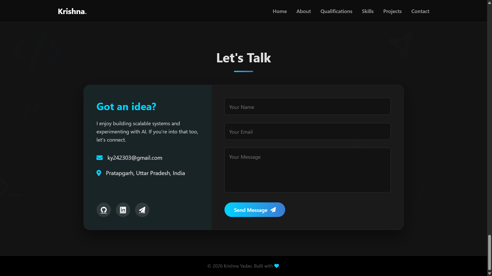
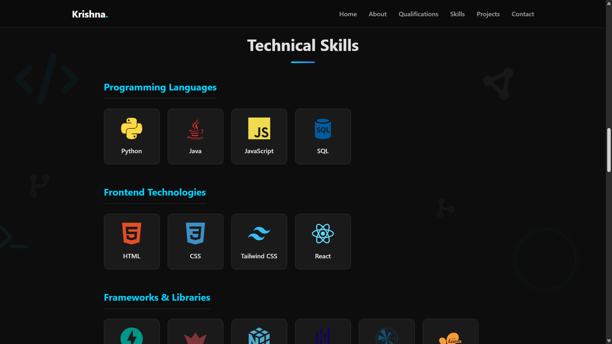
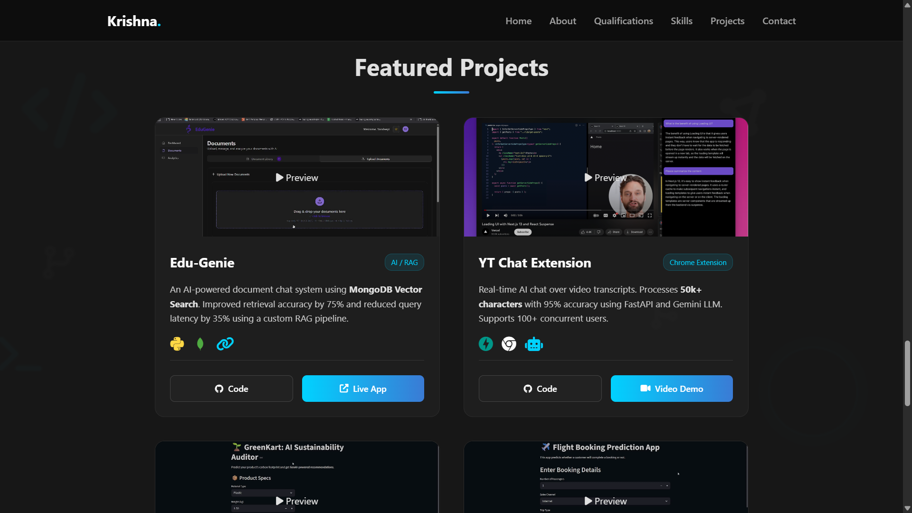
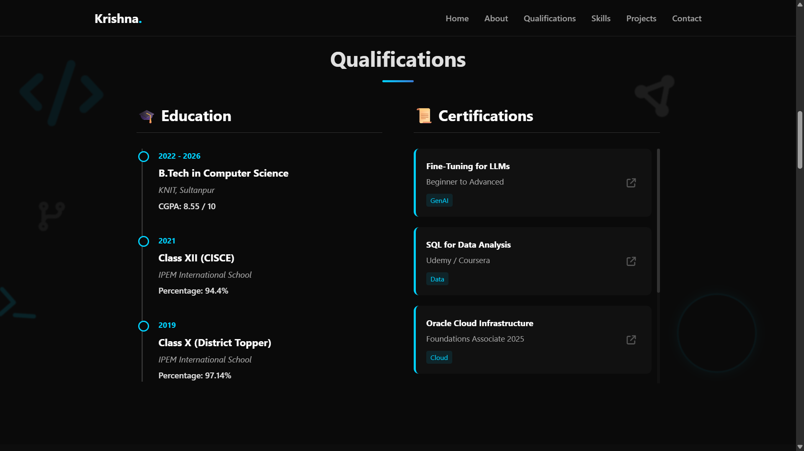

# ⚡ Krishna Yadav | AI & Backend Engineer Portfolio
## 📸 Portfolio Overview

<p align="center">
  
  
</p>

<p align="center">
  
  
</p>

<p align="center">
  
</p>

---

## 🚀 About The Project

This portfolio was built to showcase my projects in Artificial Intelligence, Backend Development, and Data Science. It moves beyond static templates by incorporating interactive elements and a modern dark-mode aesthetic.

### ✨ Key Features

- 🌌 Parallax Particle Background – Custom JavaScript animation with floating tech symbols that respond to cursor movement.
- 💎 Glassmorphism UI – Semi-transparent cards with backdrop blur effects.
- ▶️ Interactive Project Cards – Click-to-play GIF previews with hover-reveal overlays.
- 📱 Fully Responsive – Optimized layout with a mobile navigation menu.
- 📬 Working Contact Form – Integrated with Formspree for email delivery.

---

## 🛠️ Tech Stack

- **Frontend:** HTML5, CSS3, Vanilla JavaScript (ES6)
- **Icons:** Font Awesome 6 & Devicon
- **Fonts:** Google Fonts (Poppins)
- **Hosting:** GitHub Pages

---

## 📂 Directory Structure
```
Here is the clean project structure markdown without comments:

## 📂 Project Structure


yadav-krish.github.io/
│
├── assets/
│ ├── css/
│ │ └── style.css
│ ├── js/
│ │ └── main.js
│ └── images/
│ └── portfolio_images/
├── index.html
├── README.md

```
## 🏃‍♂️ How to Run Locally

- **Clone the repository:**
```
git clone https://github.com/yadav-krish/yadav-krish.github.io.git
```
- **Navigate to the folder:** Open `index.html` in your browser or use Live Server in VS Code.

---

## 🎨 Customization Guide

If you fork this repository:

- Update the contact form action URL with your own Formspree endpoint.
- Replace images inside `assets/images/`.
- Modify project details inside the `#projects` section of `index.html`.

---

## 🤝 Contact
 
- LinkedIn: https://www.linkedin.com/in/krishnayv/
- Email: krishna.22228@knit.ac.in 

---

© 2026 Krishna Yadav  
Built with code, curiosity, and a touch of AI.
